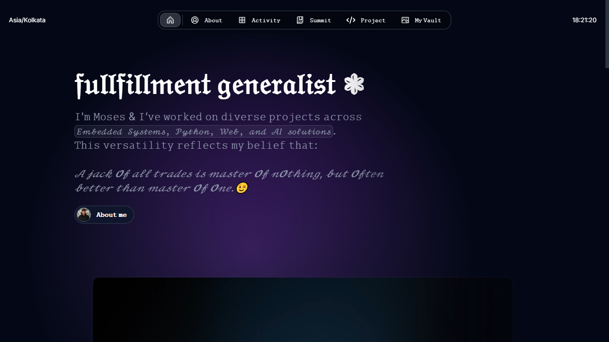
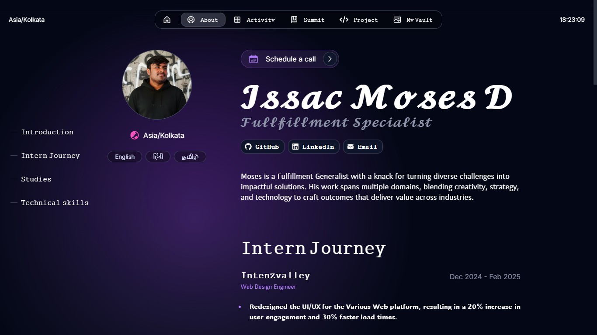
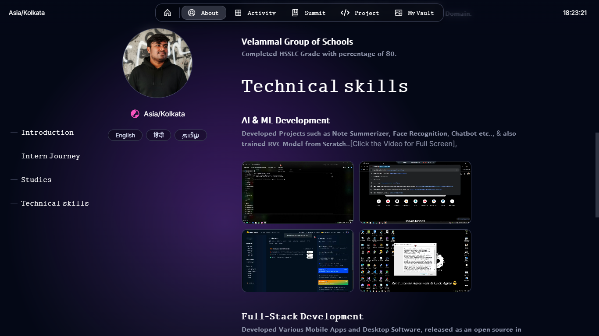
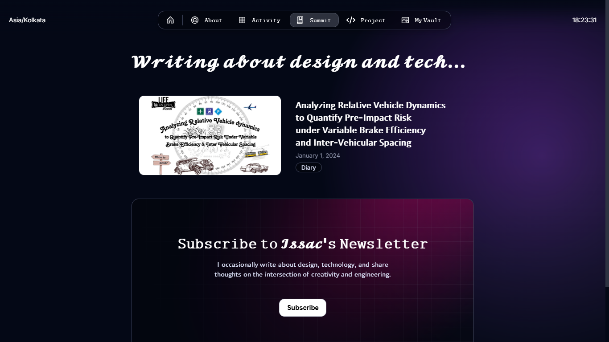
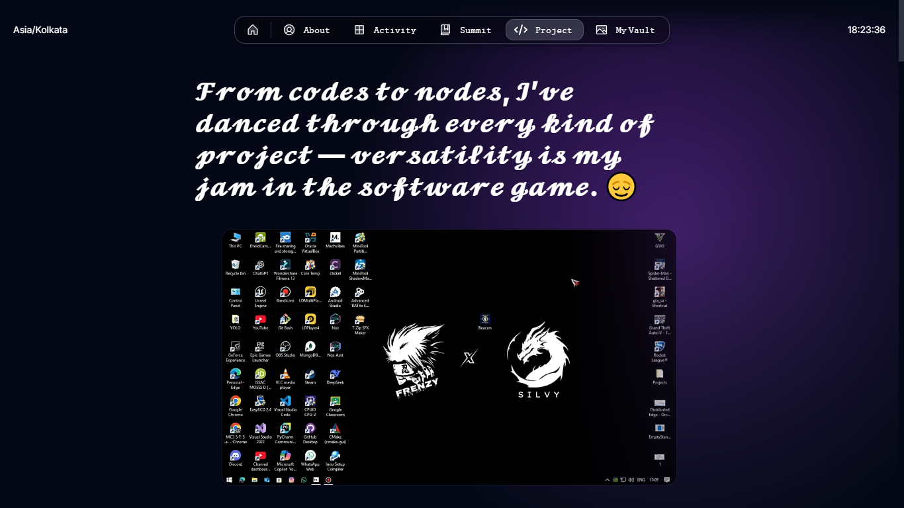
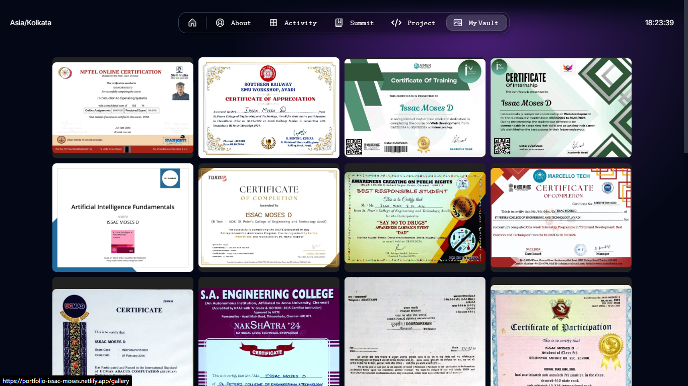

# **Issac Moses D - Personal Portfolio**

This is the source code for my personal portfolio website.
## **Live Demo**
[Visit my portfolio](https://portfolio-issac-moses.netlify.app/)








## **Live Demo**
[Visit my portfolio](https://portfolio-issac-moses.netlify.app/)


## **Getting Started**

This project is built with [Next.js](https://nextjs.org) and styled using SCSS.

### **1. Clone the Repository**
```bash
git clone https://github.com/Issac-Moses/Issac-Moses-Portfolio.git
```

### **2. Install Dependencies**
```bash
npm install
```

### **3. Run the Development Server**
```bash
npm run dev
```

### **4. Edit Configurations**
Modify settings in:
```
src/app/resources/config
```

### **5. Customize Content**
Edit content in:
```
src/app/resources/content
```

### **6. Add Blog Posts & Projects**
Create `.mdx` files in:
```
src/app/blog/posts or src/app/work/projects
```

## **Features**

### **Design & UI**
- Fully responsive and optimized for all screen sizes.
- Dark mode support.
- Minimal and elegant design.

### **Gallery**
- Interactive masonry grid layout.
- Click-to-view full-screen images.
- Optimized image loading.

### **Performance & SEO**
- Metadata and Open Graph support.
- Fast page loading with Next.js optimizations.
- Lazy loading for images.

## **Deployment**

### **Deploy to Netlify**
1. Link your GitHub repository to Netlify.
2. Set the build command:
   ```bash
   npm run build
   ```
3. Set the publish directory to `.next`.
4. Deploy and get your live URL.

## **Connect with Me**
- LinkedIn: [ISSAC MOSES D](https://www.linkedin.com/in/i%EF%BD%93%EF%BD%93-a-c-m-%E5%8F%A3%EF%BD%93%E3%83%A2%EF%BD%93-d-12837831b/)
- GitHub: [ISSAC MOSES D](https://github.com/Issac-Moses)

## **License**
This project is licensed under the MIT License.
